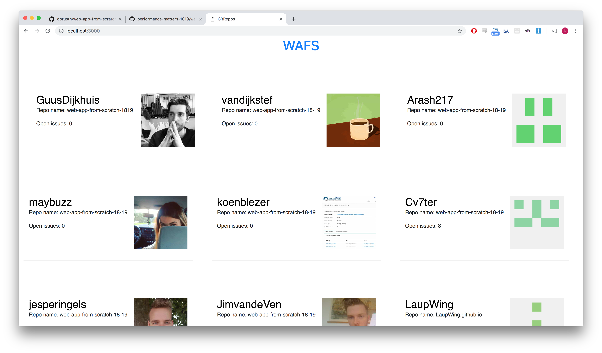
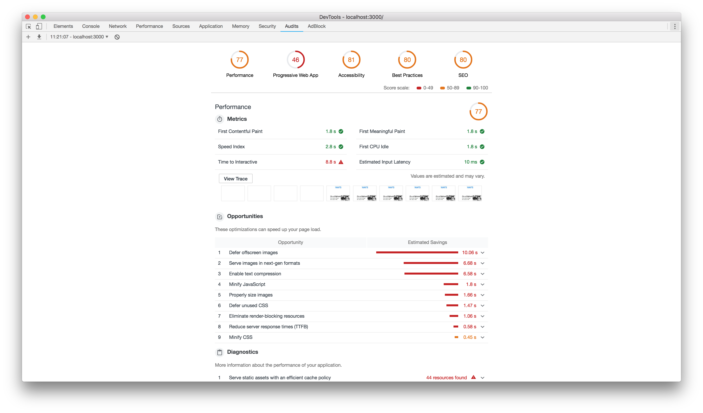
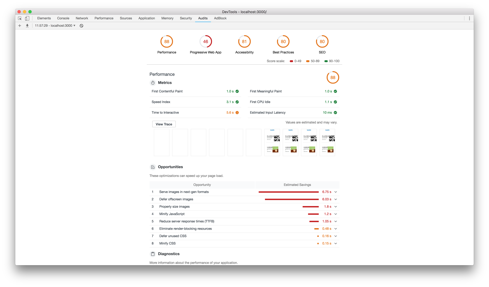
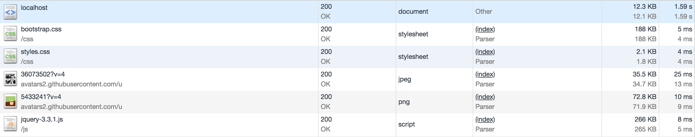
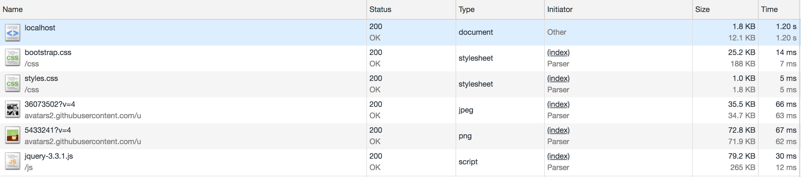
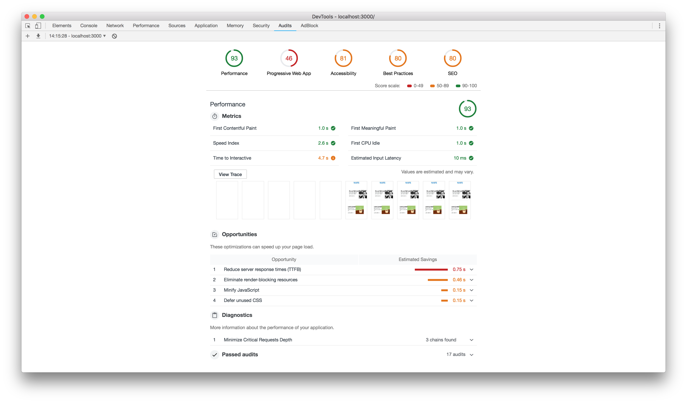
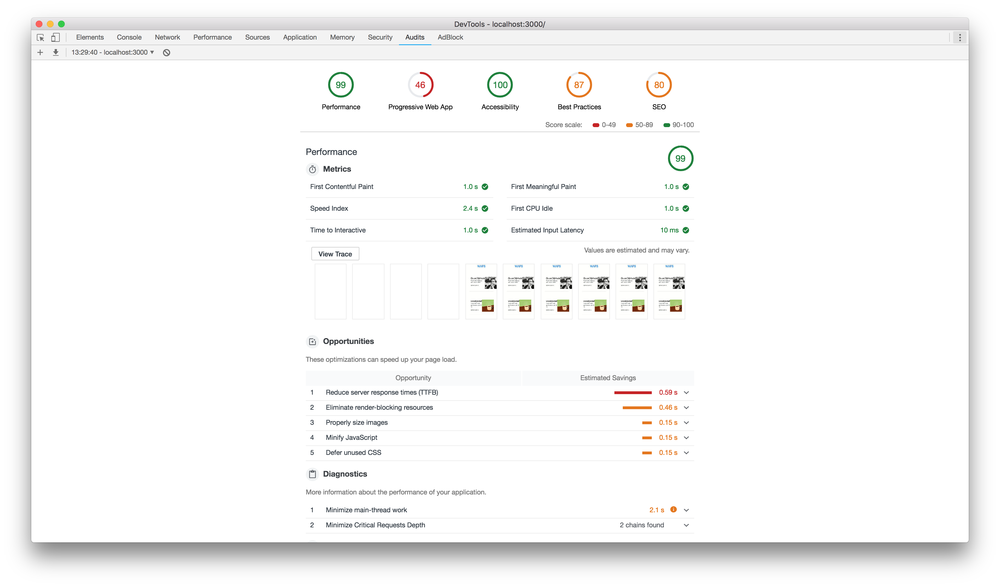
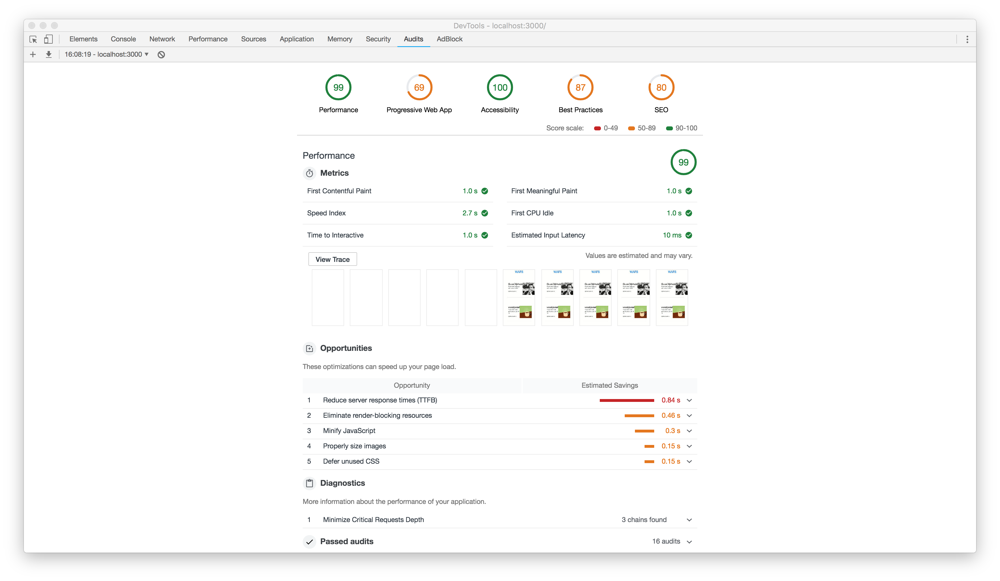

# Performance matters

## github repos web performance

For this project i have optimized the load times of my web-app-from-scratch project.


<!-- Add a link to your live demo in GitHub Pages 🌐-->
## Code
[Live demo](https://performance-matters-1819.herokuapp.com/)|[Repo](https://github.com/dorusth/performance-matters-1819/)

<!-- ☝️ replace this description with a description of your own work -->

<!-- Add a nice image here at the end of the week, showing off your shiny frontend 📸 -->


<!-- Maybe a table of contents here? 📚 -->
## table of contents
- [Installation](#Installation)
- [improvements](#performance improvements)
- [to-do/done](#to-do/done)

<!-- How about a section that describes how to install this project? 🤓 -->
## Installation
This project works with: node, express, handlebars and compression.
Clone the repo with:
```bash
$ git clone https://github.com/dorusth/performance-matters-1819.git
```
to use the app use
```bash
$ npm install
$ npm start
```
and open "http://localhost:8080/"

<!-- ...but how does one use this project? What are its features 🤔 -->
## performance improvements


### Compression

Using the compression package i reduced the file size of the javascript and css.





### Image optimisation

I've stored the images locally and optimized them for better loading times.


After that i added webp format images for further optimisation when supported


### Service Worker

I've Added a service worker for caching the main page and styling and it increased performance


After running an audit without clearing cache the performance reduced on the TTFB.


## to-do/done
- [x] serverside rendering
- [x] File Compression
- [x] Image optimisation
- [x] webp
- [x] Reduce TTFB
- [x] service worker


[MIT](LICENCE) © [Dorus ten Haaf](https://dorustenhaaf.com)
