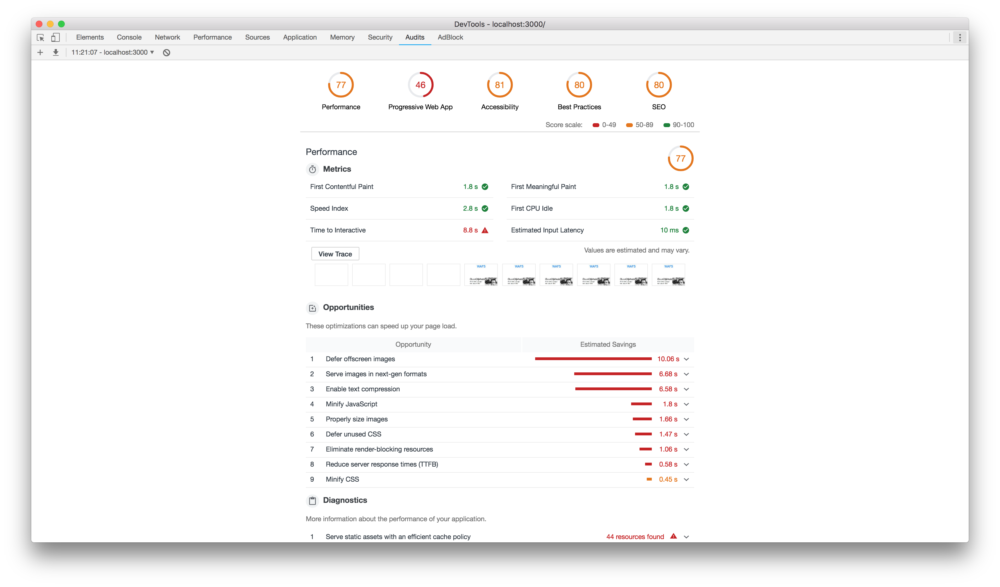
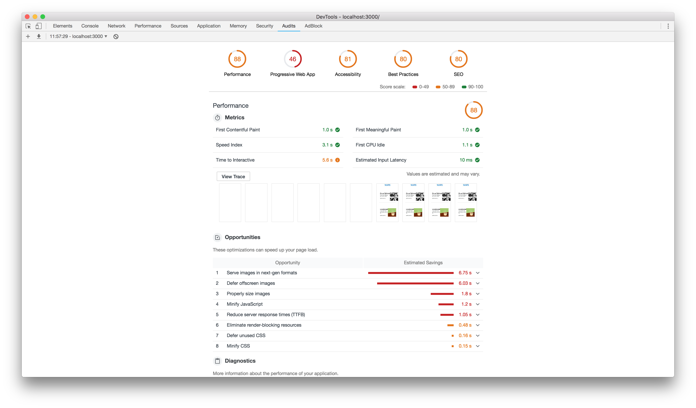
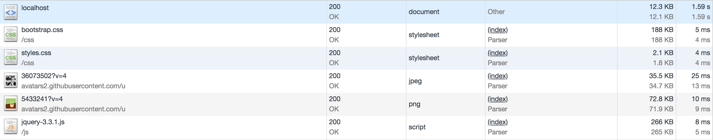
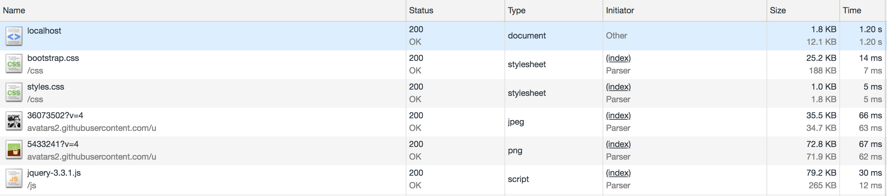
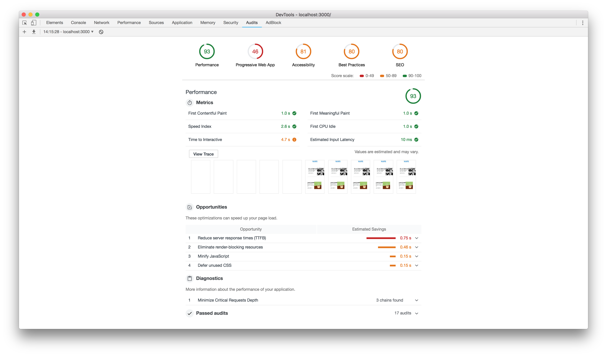

# Project 1 @cmda-minor-web · 2018-2019

## githus repos web performance

For this project i have optimized the load times of my web-app-from-scratch project.


<!-- Add a link to your live demo in GitHub Pages 🌐-->
## Code
[Repo](https://github.com/dorusth/performance-matters-1819/tree/image_optimize/wafs)

<!-- ☝️ replace this description with a description of your own work -->

<!-- Add a nice image here at the end of the week, showing off your shiny frontend 📸 -->


<!-- Maybe a table of contents here? 📚 -->
## table of contents
- [Installation](#Installation)
- [Features](#performance improvements)

<!-- How about a section that describes how to install this project? 🤓 -->
## Installation
This project works with: node, express, handlebars and compression.
Clone the repo with:
```bash
$ git clone --branch image_optimize https://github.com/dorusth/performance-matters-1819.git
```
to use the app use
```bash
$ npm install
$ npm start
```
and open "http://localhost:3000/"

<!-- ...but how does one use this project? What are its features 🤔 -->
## performance improvements

<details>
 <summary>Compression</summary>
 
 Using the compression package i reduced the file size of the javascript and css.
 
 
</details>

<details>
 <summary>Image optimisation</summary>
 
 I've stored the images locally and optimized them for better loading times.
</details>


## to-do
- [x] File Compression
- [x] Image optimisation
- [ ] Minify files
- [ ] Reduce TTFB


[MIT](LICENCE) © [Dorus ten Haaf](https://dorustenhaaf.com)
